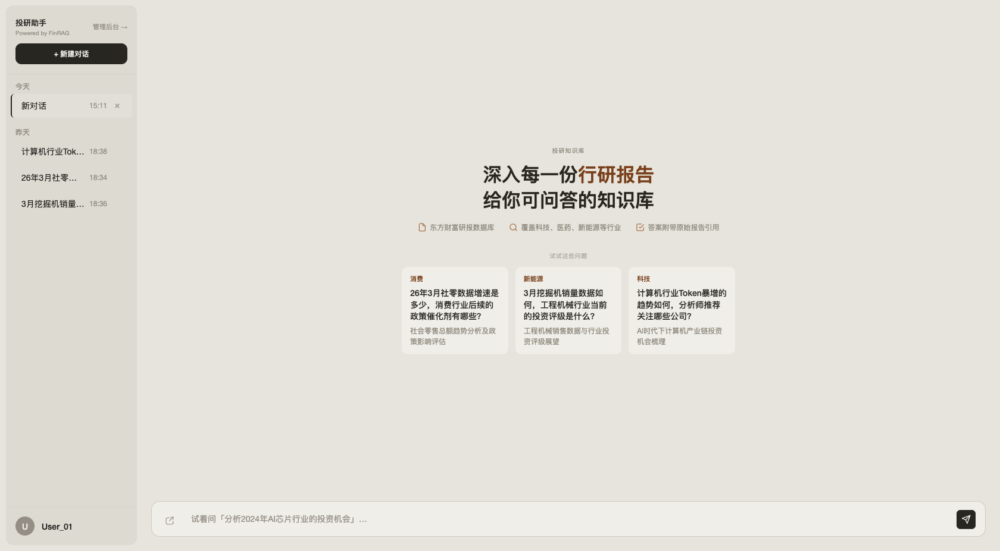
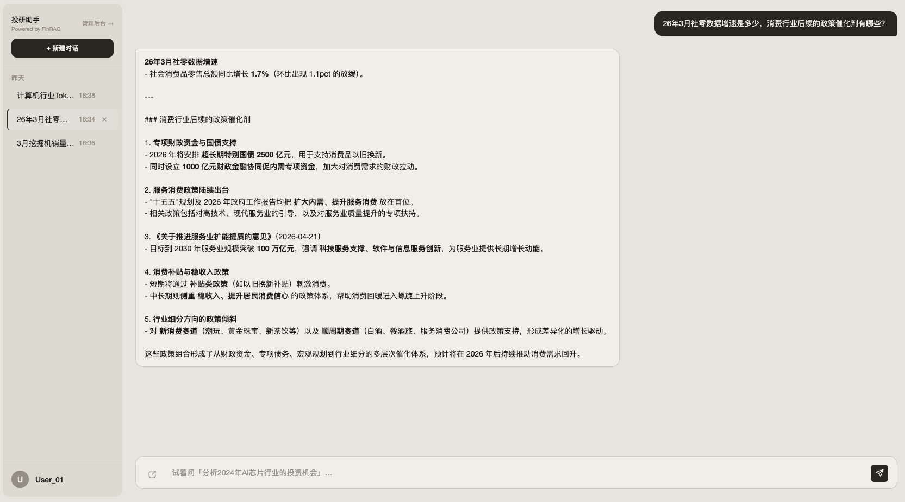
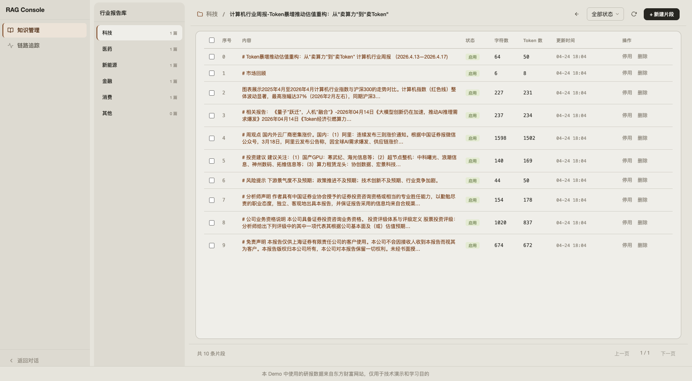
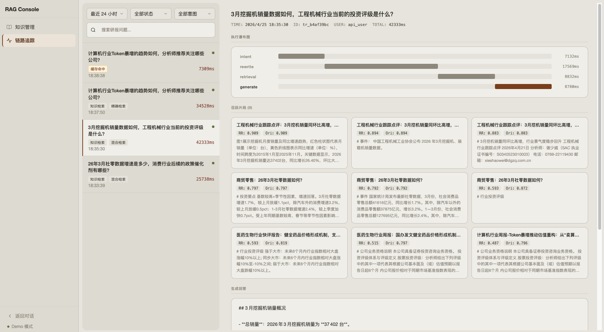
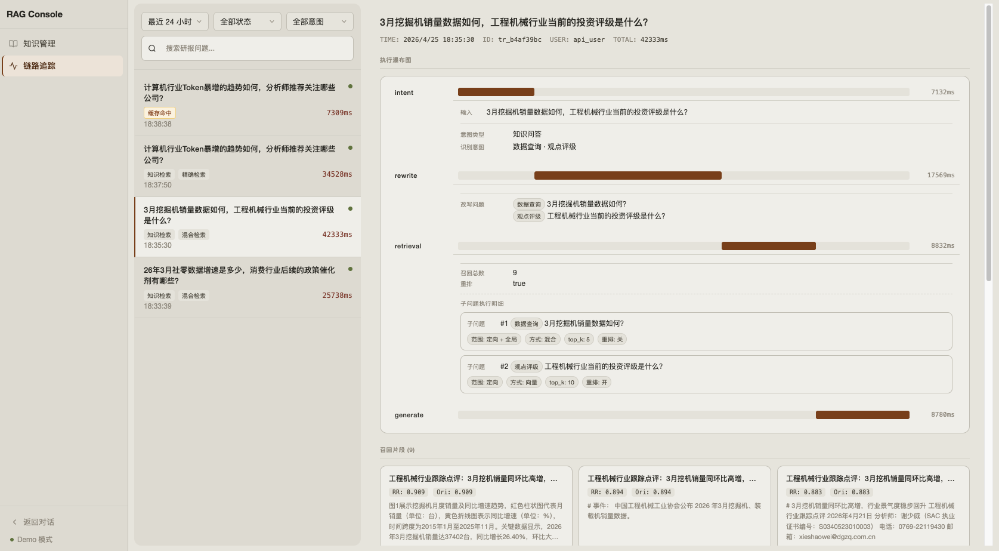

# FinRAG Frontend Demo

> 金融研报智能问答系统 · 前端演示层


**本仓库为纯前端演示层**，用于在线展示产品交互流程。完整全栈实现（RAG Pipeline、向量检索、LLM 调用）请见：

👉 **[FinRAG 主仓库（后端 + 完整系统）](https://github.com/buchisutin/FinRAG-demo)**

---







🔗 **[在线 Demo](https://fin-rag-demo.vercel.app)**

---

## 项目背景

[FinRAG 主仓库](https://github.com/buchisutin/FinRAG-demo) 实现了一套完整的金融研报 RAG 系统，涵盖文档解析、向量入库、混合检索、Rerank、LLM 生成和链路追踪。

本仓库为该系统的**前端演示层**，包含对话、知识库、链路追踪三个核心页面，采用 mock 数据进行演示。

---

## 技术亮点

- **零构建依赖**：无框架、无 npm 依赖，纯 HTML / CSS / ES6+，冷启动 < 1s
- **链路追踪可视化**：基于 span 时间戳手动计算偏移量，用纯 CSS 渲染调用瀑布图，直观展示 Embedding → Retrieval → Rerank → LLM 各阶段耗时
- **多会话状态管理**：事件驱动架构，支持会话创建、切换、删除，状态与 UI 完全解耦
- **组件化设计**：公共侧边栏、导航、自定义 Select 抽取为独立模块 (`shell.js / shell.css`)，多页面复用零重复代码
- **数据驱动**：演示数据通过外部 `mock_traces.json` 驱动，支持不修改代码的数据更新

---

## 页面结构

```
frontend/
├── chat/
│   └── index.html          # 对话界面：多会话管理、Markdown 渲染、样例问题
├── knowledge.html          # 知识库管理：行业报告库、文档分块浏览与筛选
├── tracing.html            # 链路追踪：调用瀑布图、缓存命中、性能分析
├── mock_traces.json        # 追踪数据源（编辑此文件即可更新演示数据）
├── favicon.svg             # 网站图标
└── assets/
    ├── shell.js            # 公共组件：侧边栏、导航、自定义 Select
    ├── shell.css           # 全局样式系统（CSS 变量 + 组件库）
    └── api.js              # 数据加载工具
```

---

## 功能说明

### 💬 对话页面 `/chat/index.html`
- 多会话管理：创建、切换、删除对话
- Markdown 格式回答渲染
- 样例问题快捷入口

### 📚 知识库管理 `/knowledge.html`
- 五大行业分类：科技 / 医药 / 新能源 / 金融 / 消费
- 文档列表浏览 + 分块详情查看
- 分块状态筛选 + 分页

### 🔍 链路追踪 `/tracing.html`
- 调用瀑布图：可视化各阶段耗时
- 缓存命中标识
- 查询记录搜索与筛选

---

## 快速开始

### 本地预览

```bash
python3 -m http.server 8080
```

打开浏览器访问：
- **对话页面**：http://localhost:8080/chat/
- **知识库**：http://localhost:8080/knowledge.html
- **链路追踪**：http://localhost:8080/tracing.html

> ⚠️ 必须通过 HTTP 服务器访问。直接双击 HTML 文件会因跨域限制导致 JSON 加载失败。

---

## License

MIT
